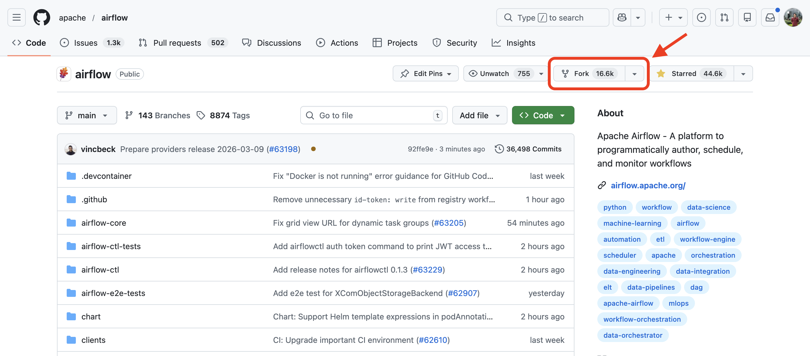

# GitHub Setup

## Create a GitHub account

Create a GitHub account if you don't already have one.

## Fork the Apache Airflow repository

Fork the [Apache Airflow repository](https://github.com/apache/airflow/){target=_blank} to your GitHub account.

Click the **Fork** button at the top-right corner of the repository page (see the image below). This will create your own copy of the repository under your GitHub account.



## Clone your fork locally

Clone the repository from **your GitHub account**:

```bash
git clone git@github.com:<your-username>/airflow.git
cd airflow
```

Replace `<your-username>` with your GitHub username. For example, my GitHub username is `zkan`, so I would run:

```bash
git clone git@github.com:zkan/airflow.git
cd airflow
```

## Add the upstream remote and verify

Add the official Airflow repository as the `upstream` remote:

```bash
git remote add upstream git@github.com:apache/airflow.git
git remote -v
```

You should see both remotes:

- `origin` → your fork
- `upstream` → `apache/airflow`
