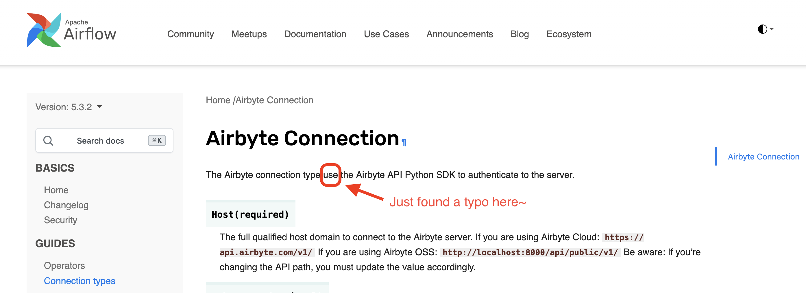
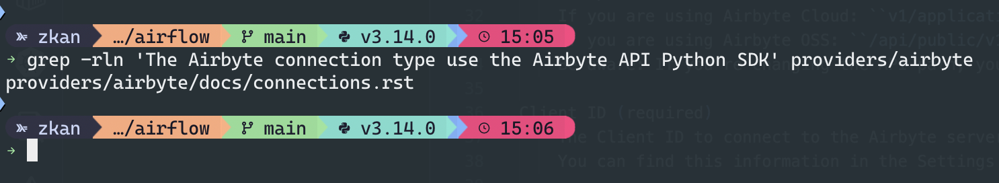
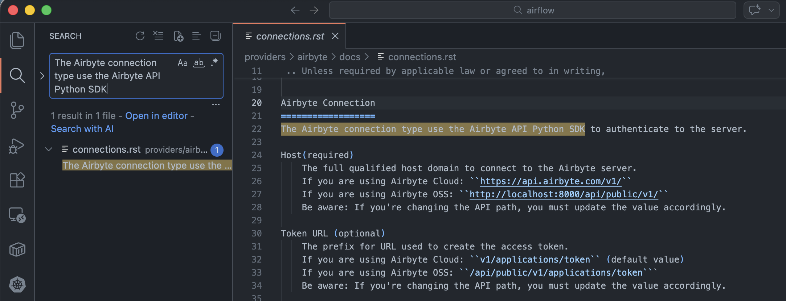

# Start Contributing

In this workshop, we'll start with documentation or translation contributions.
These are the easiest and most beginner-friendly ways to get involved.

You don't need to understand Airflow internals — just improve clarity or
language support.

## Starting Airflow with Breeze

```bash
breeze start-airflow
```

It may take a moment for Airflow to start. Once it's ready, access the web interface at [http://localhost:28080/](http://localhost:28080){target=_blank}.

Ports are forwarded to the running docker containers for webserver and database
- 12322 -> forwarded to Airflow ssh server -> airflow:22
- 28080 -> forwarded to Airflow api server (Airflow 3) or webserver (Airflow 2) -> airflow:8080
- 25555 -> forwarded to Flower dashboard -> airflow:5555
- 25433 -> forwarded to Postgres database -> postgres:5432
- 23306 -> forwarded to MySQL database  -> mysql:3306
- 26379 -> forwarded to Redis broker -> redis:6379
- 25672 -> forwarded to Rabbitmq -> rabbitmq:5672

Direct links to those services that you can use from the host:
- ssh connection for remote debugging: `ssh -p 12322 airflow@localhost` (password: airflow)
- API server or webserver: [http://localhost:28080](http://localhost:28080){target=_blank} (username: admin, password: admin)
- Flower: [http://localhost:25555](http://localhost:25555){target=_blank}
- Postgres: jdbc:postgresql://localhost:25433/airflow?user=postgres&password=airflow
- Mysql: jdbc:mysql://localhost:23306/airflow?user=root
- Redis: redis://localhost:26379/0

- Your dags for webserver and scheduler are read from `/files/dags` directory which is mounted from folder in Airflow sources:
	- `/Users/zkan/Work/zkan/airflow/files/dags`
- Your plugins are read from `/files/plugins` directory which is mounted from folder in Airflow sources:
	- `/Users/zkan/Work/zkan/airflow/files/plugins`
- You can add `airflow-breeze-config` directory. Place it in `/Users/zkan/Work/zkan/airflow/files/airflow-breeze-config` and:
	- Add `environment_variables.env` - to make breeze source the variables automatically for you
	- Add `.tmux.conf` - to add extra initial configuration to `tmux`
	- Add `init.sh` - this file will be sourced when you enter container, so you can add any custom code there.
	- Add `requirements.
- You can also share other files, put them under `/Users/zkan/Work/zkan/airflow/files` folder and they will be visible in `/files/` folder inside the container.

## Contributing to Documentation

Edit a documentation file, e.g., `airflow-ctl/docs/index.rst`.

Make a small improvement:

- Fix a typo
- Improve a sentence
- Clarify wording
- Update formatting

Keep the change small and focused.

Build the documentation.

```bash
breeze build-docs apache-airflow-ctl
```

Preview the documentation locally by running the following command for a lighter resource option:

```bash
./docs/start_doc_server.sh
```

Then open:

- [http://localhost:8000](http://localhost:8000){target=_blank}
- Documentation list [http://localhost:8000/docs/](http://localhost:8000/docs/){target=_blank}

Verify your change appears correctly.

### Example Issue You Can Contribute To

There is a small typo on the Airbyte connection page (as of Mar 10, 2026) that needs to be fixed. See the screenshot below.



You can search for the text on the page using [grep](https://man7.org/linux/man-pages/man1/grep.1.html){target=_blank} in your terminal.

```bash
grep -rln 'The Airbyte connection type use the Airbyte API Python SDK' providers/airbyte
```



Alternatively, you can search for it in VS Code.



## Contributing to Translation (UI i18n)

Another easy entry point is improving UI translations.

Read the Internationalization (i18n) policy
[here](https://github.com/apache/airflow/blob/main/airflow-core/src/airflow/ui/public/i18n/README.md){target=_blank}.
This explains how translations are structured.

To check translation completeness:

```bash
breeze ui check-translation-completeness
```

To check a specific language (e.g., Thai):

```bash
breeze ui check-translation-completeness --language th
```

You can:

- Improve existing translations
- Add missing translations
- Correct unclear wording
